# Make your own custom heatmap with OpenStreetMap data and Mapbox


## [Cartogram](https://www.mapbox.com/cartogram/)

A colorized map in seconds. Upload an image to automatically apply its dominant colors to roads, land, buildings, and bodies of water. Drag the eyedroppers around to customize the colors further, then go the next step of importing the style into Studio, where you have complete control over the map’s appearance.

## Mapbox Studio

Create a free Mapbox account at https://www.mapbox.com/signup/

If you have a Mapbox account, log in, if not sign up for Mapbox. It’s totally free to sign up.

### Introduction to Mapbox Studio

* Create a [static map](https://www.mapbox.com/help/how-static-maps-work/)
* [Create a style](https://www.mapbox.com/help/how-map-design-works/#how-map-styles-work) for a basemap for a [dynamic, interactive web map or app](https://www.mapbox.com/help/how-web-apps-work/)
* [Manage and edit layers](https://www.mapbox.com/studio-manual/reference/styles/#style-editor) in your style
* [Add data](https://www.mapbox.com/help/uploads/) to a style
* Make [beautiful custom styles](https://www.mapbox.com/designer-maps/)
* Use [dynamic styling rules](https://blog.mapbox.com/studio-expressions-design-81012e2dab55) (e.g. based on zoom level, based on field in the data etc.)

### Walkthrough of Mapbox Studio interface

* Datasets, tilesets, and styles
* [Mapbox Studio Manual](https://www.mapbox.com/studio-manual/overview/)
* [Mapbox Guide to Map Design](https://www.mapbox.com/map-design/)

## Heatmaps in Mapbox GL and Studio

Today, you’ll learn how to create a heatmap in Mapbox Studio based on OpenStreetMap data. A heatmap is a great way to show off the work you’ve done in OpenStreetMap. Pascal Neis’s [Your OSM Heat Map](http://yosmhm.neis-one.org/) tool is super informative and a lot of fun, but sometimes you want a thematic map instead of a historical one.

Mapbox GL has two ways to simplify how a map visualizes data in bulk: clustering and heatmaps. Clustering is appropriate for displaying dense point data that the user can navigate and select in, whereas heatmaps are appropriate for visualizing density or other characteristics of the data.

## Create a new style

1. Go to your [Styles](https://www.mapbox.com/studio/styles/) page in Mapbox Studio.
2. Under Create a new style, click the “Pick a template or upload a style” box, then choose Light in the dialog that appears.
3. You will be taken to the Mapbox Studio style editor, where you will create your map style. Rename your new style so that it will be easy to find later. Click into the title field in the upper left side of the screen and change the title to something unique like “Detroit Buildings”.
   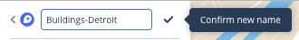

## Add a heatmap layer

Click the Select data tab and select the building layer of Mapbox Streets v7 as the data source.

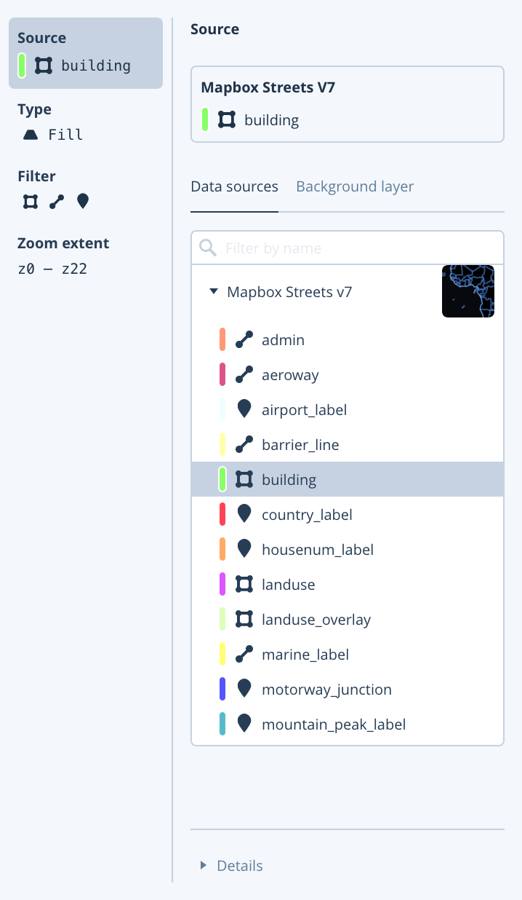

In fact, no building data appears at this zoom level. You have to zoom in to see more buildings. We’ll talk more about that in a moment.

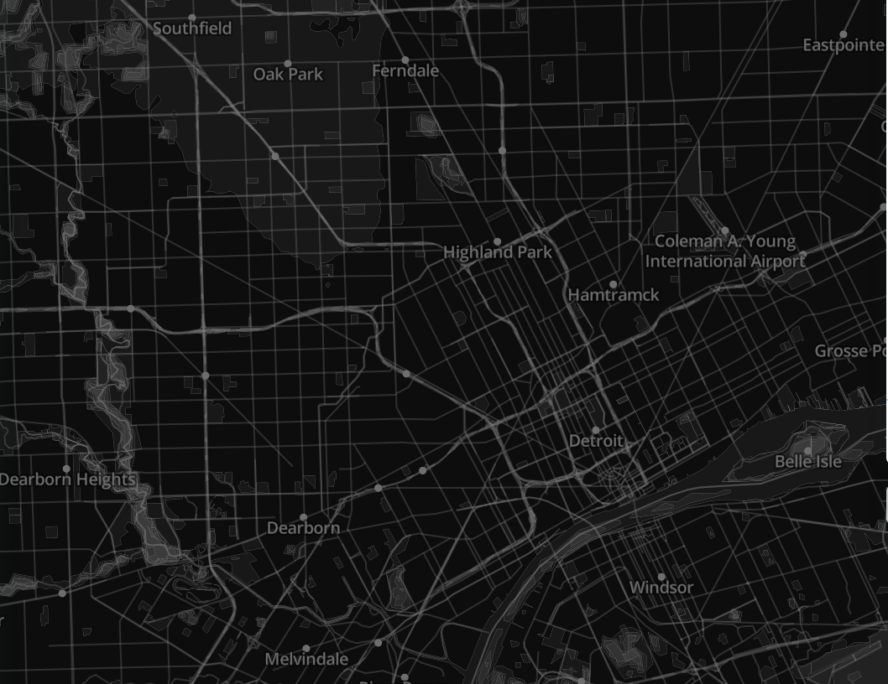

Once you zoom in to z13, you start to see some of the largest buildings come in:

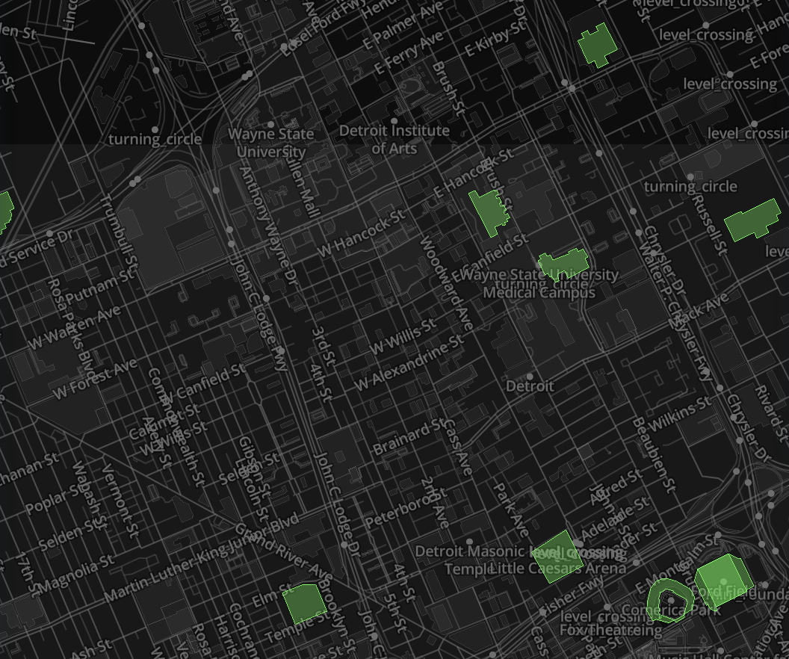

Change the layer from a fill layer to a heatmap layer.

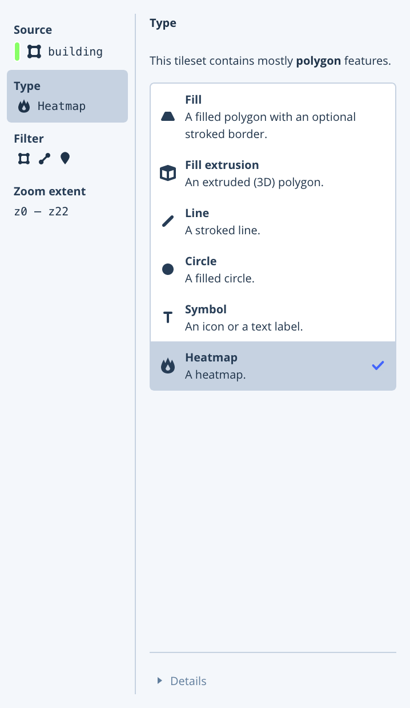

Mapbox GL generates a heatmap based on the points within the data, which in this case is each corner of a building.

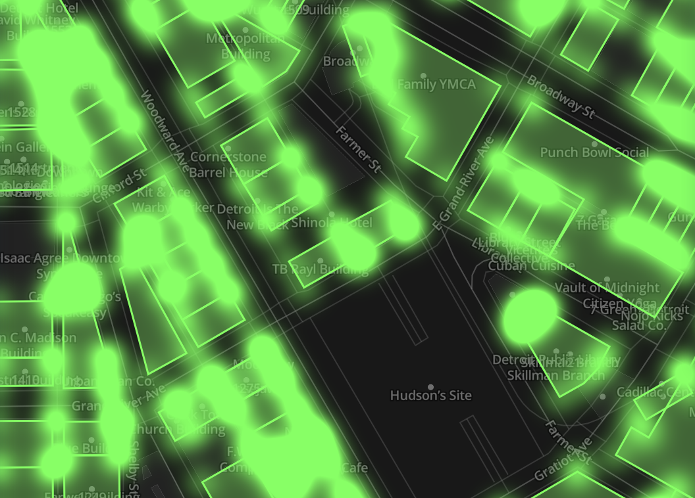

If you zoom out, that can be a decent proxy for building density, but unfortunately the Streets source filters out most buildings as you zoom out for performance reasons, which makes this data not as suitable for a heatmap.

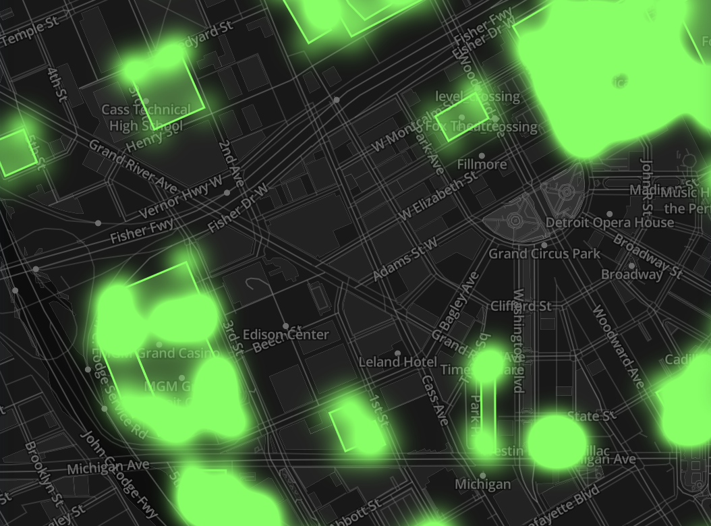

## Extracting data from OpenStreetMap

For the full data we need, we’ll import it from OpenStreetMap using [overpass turbo](https://overpass-turbo.eu/). It uses a complex query language, but overpass turbo can generate that code using much simpler syntax. Click the Wizard button and type in `building=*`. That’ll get us anything with the `building` key set to any value within the currently visible part of the map.

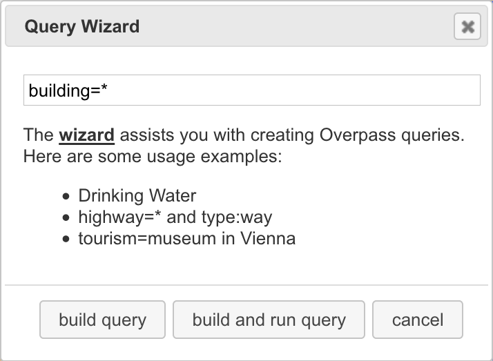


That’s a lot of data just for the immediate downtown area. If you zoom out, you’ll download too much data to load in the browser.

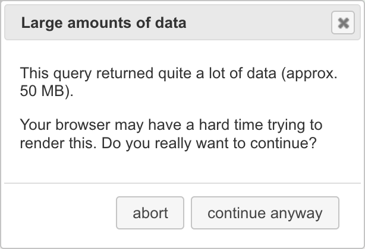

There are some easy ways to limit the data to something manageable:

* Filter the type of data: for this query, we care about buildings, which are mapped as ways. We don’t really need nodes or relations.
* Filter down to a geographic region, like Detroit.
* Filter out everything but the contributions of a particular user.

This is what you get when you query for `building=* and type:way` in Detroit. It weighs 38 MB. Please be respectful of the conference organizers and download [this ZIP file of the data](https://www.dropbox.com/s/1xmb2qtyaecyvfk/detroit-buildings.geojson.zip?dl=0) instead of running this query. You can begin to see why the Mapbox Streets source excludes so many buildings at lower zoom levels – you’d never want to load such a large amount of data on a phone, for example.

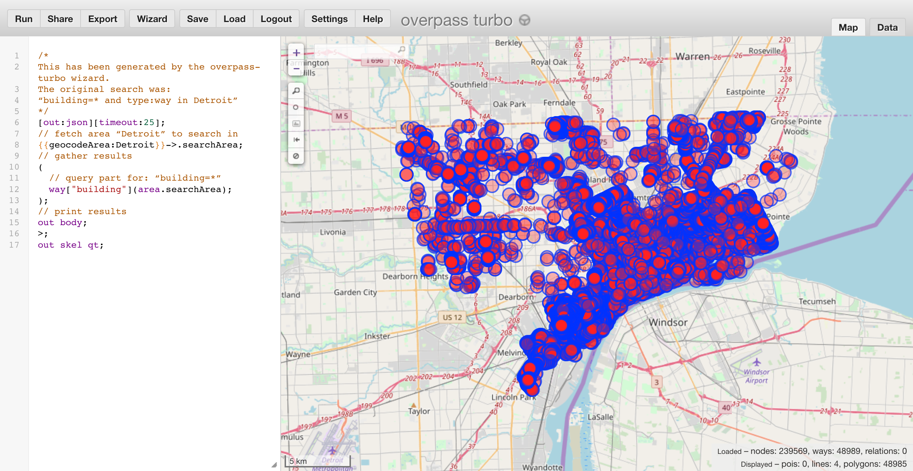

The Overpass API can actually handle a lot more data. Let’s expand the query from just Detroit proper to all of Metro Detroit. First, increase the timeout from 25 seconds to 50 seconds. Then replace `{{geocodeArea:Detroit}}->.searchArea`; with the following code:

```

(
  {{geocodeArea:Lapeer County, Michigan}};
  {{geocodeArea:Livingston County, Michigan}};
  {{geocodeArea:Macomb County, Michigan}};
  {{geocodeArea:Oakland County, Michigan}};
  {{geocodeArea:Saint Clair County, Michigan}};
  {{geocodeArea:Wayne County, Michigan}};
)->.searchArea;
```

That geocodes each of the county names to the area formed by the county boundary relation, then unions the areas and stores them as the `searchArea` variable. Unioning areas is useful when you want to query discontiguous regions.

Again, [this query](http://overpass-turbo.eu/s/Cz0) returns a _lot_ of data, so for now please [download this ZIP file](https://www.dropbox.com/s/8vrsy5mhhcx0pk7/metro-detroit-buildings.geojson.zip?dl=0).

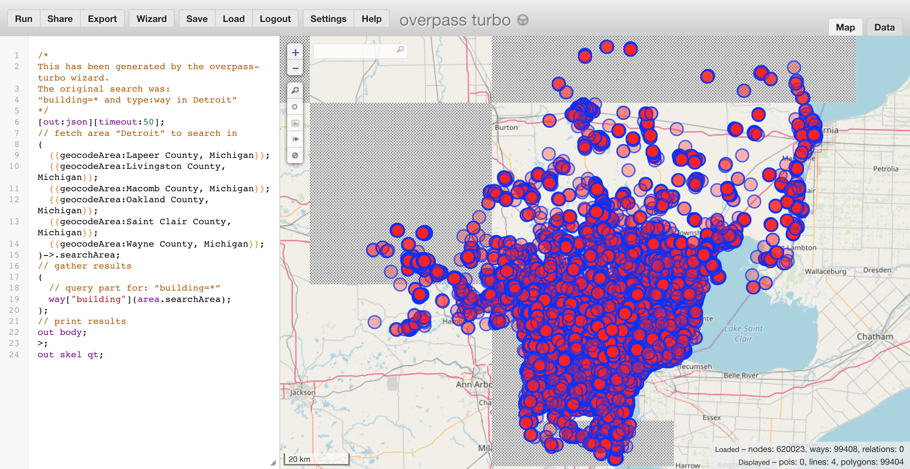

This walkthrough shows how to make a heatmap of all the buildings in the area, but if you’re interested in showing off just your own work, you can append `and user:"Armchair Mapper"` to the wizard query, which limits the results to the buildings that were last modified by Armchair Mapper.

One more thing: the last part of the query says:

```
out body;
>;
out skel qt;
```

Essentially this cryptic code returns raw data. That’s usually a good thing, but for our heatmap it’s a problem. Remember how the heatmap we made earlier was based on the corners of each building? In other words, a typical building generates four hotspots when fully zoomed in. To correctly count each building only once, the query needs to return the center of each building. Replace those last three lines with this line:

```
out center;
```

As a bonus, [this query](http://overpass-turbo.eu/s/Cz1) results in [a smaller ZIP file](https://www.dropbox.com/s/f59uiep39ab2edg/metro-detroit-centers.geojson.zip?dl=0).


You can export to multiple formats, but the most interoperable one is GeoJSON. All three ZIP files above contain GeoJSON.

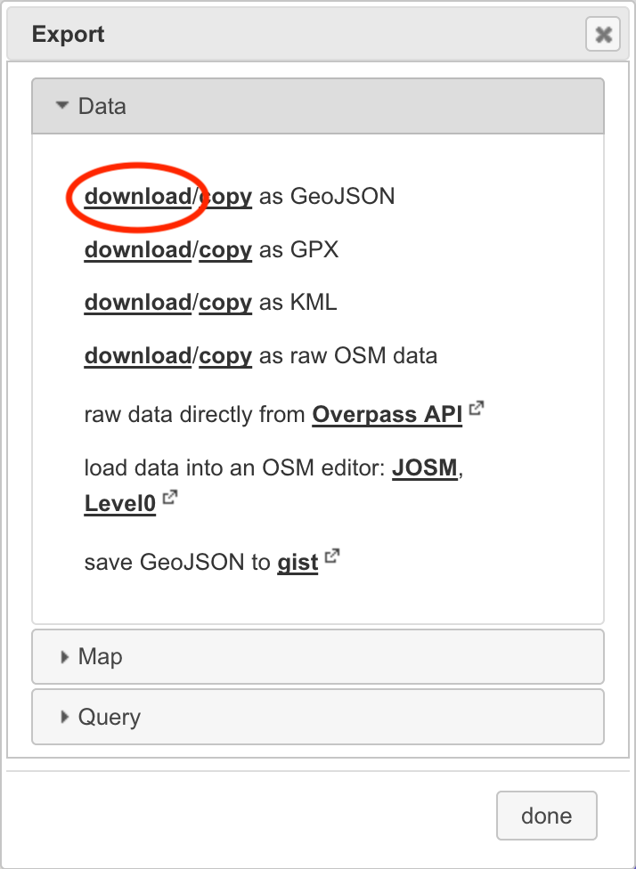

For complex queries, here’s [a quick introductory guide](https://github.com/mapbox/mapping/wiki/Overpass-Guide) and [a list of commonly used queries](https://github.com/mapbox/mapping/wiki/Overpass:-Frequently-used-queries). [The full query language reference](https://wiki.openstreetmap.org/wiki/Overpass_API/Overpass_QL) contains a lot of goodies for advanced users.

## Back to Studio

Next, bring the GeoJSON data into Studio by importing it as a tileset. Switch to the Tilesets tab, then click New Tileset. Drag the GeoJSON file you downloaded or exported into the dialog that appears. It takes a while to process.

Example: https://www.mapbox.com/studio/tilesets/1ec5.5dxtwy7u/

**Note:** Metro Detroit has enough building data that the GeoJSON exceeds the 5&nbsp;MB limit for uploads within Studio. To get around this limitation, use the [Uploads API](https://www.mapbox.com/api-documentation/#uploads), which has a more generous limit of 1&nbsp;GB for GeoJSON files.

Now that we have more data, let’s go through the motions of adding a heatmap layer again. Once again, choose a layer in a style, but this time the layers come from the tileset we just uploaded.

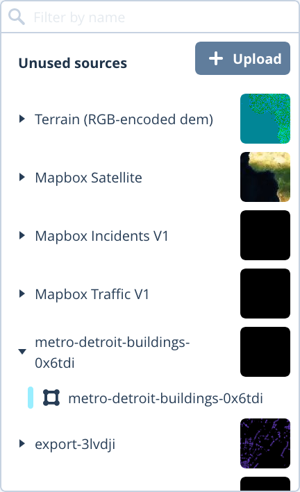

If the layer’s type changes to Fill as a result of selecting this tileset layer, change the type back to Heatmap. The style is starting to look usable, at least at z11 in the “X-ray” data preview mode.

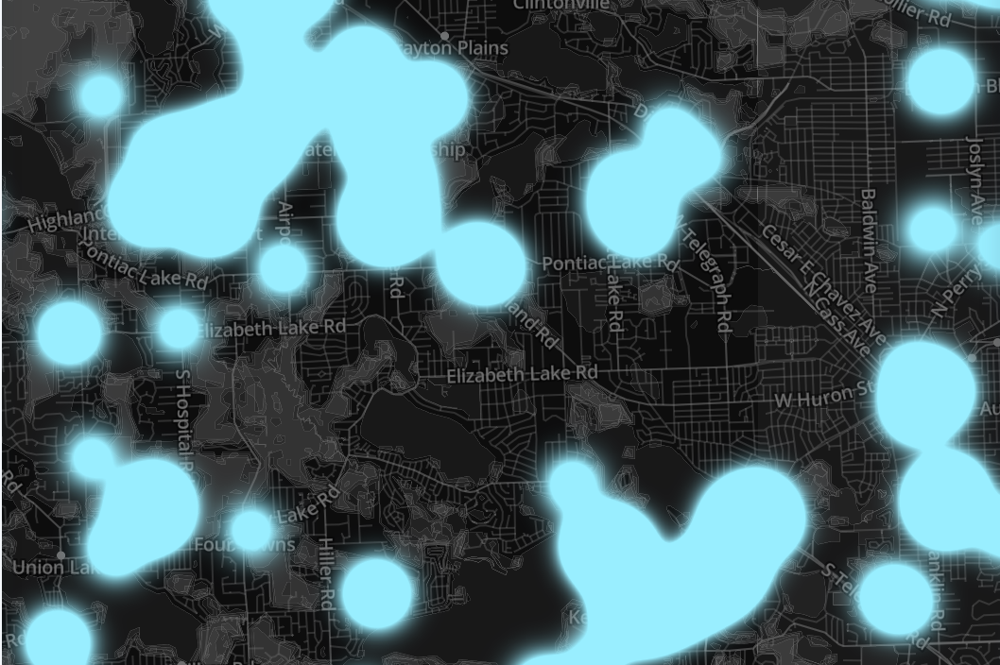

Switch back to the Style tab. The heatmap is finally usable. Move the heatmap layer below label layers so the labels are visible. In fact, move them below the streets, right above the building layer.

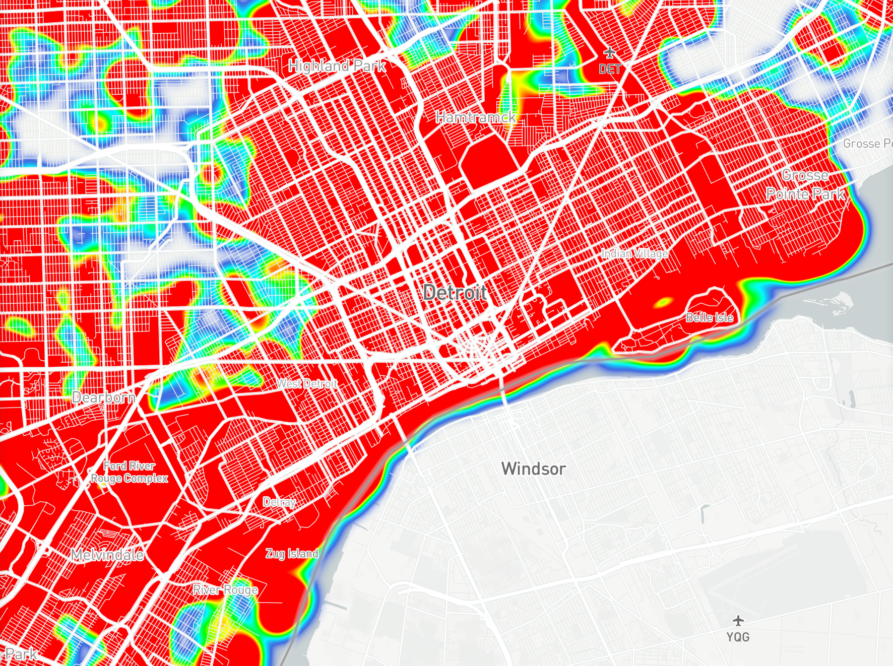

The streets provide a useful reference point for understanding that building mapping has been prioritized along certain corridors.

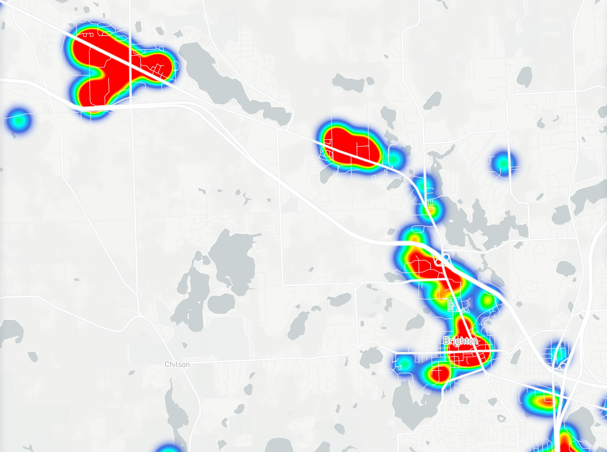

A heatmap isn’t very useful when each spot represents an individual building, so let’s have the heatmap layer fade away at the highest zoom levels where the Streets source provides comprehensive building coverage.

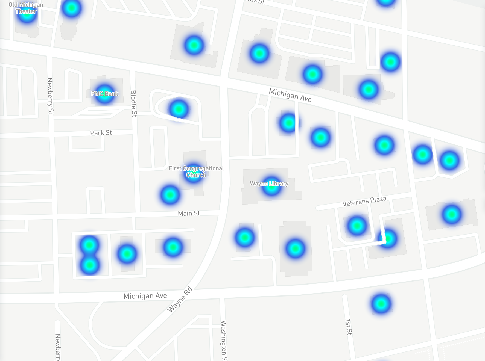

Click Opacity, then Style across zoom range. Add stops for an opacity of 1 (fully opaque) at z15 and 0 (fully transparent) at z16.

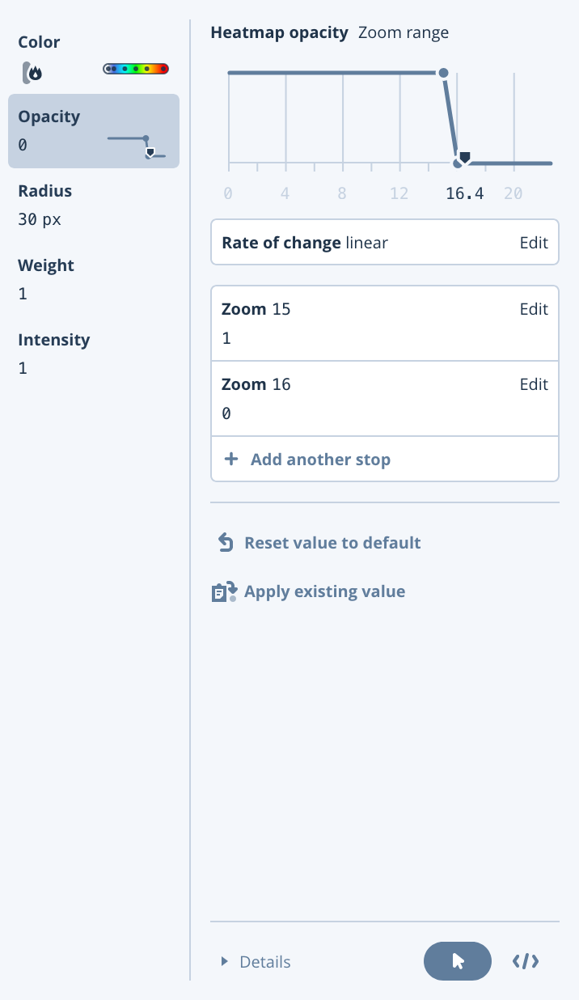

Let’s say I’m satisfied that building coverage per se is in pretty good shape across Metro Detroit, but what I really want to know is the coverage of building heights, which are useful for 3D maps or for analyzing available square footage. Switch back to the Select data tab, then click Filter. Here, you can filter the features based on certain criteria. We want the buildings for which either the `building:height` tag or the `building:levels` tag exists.

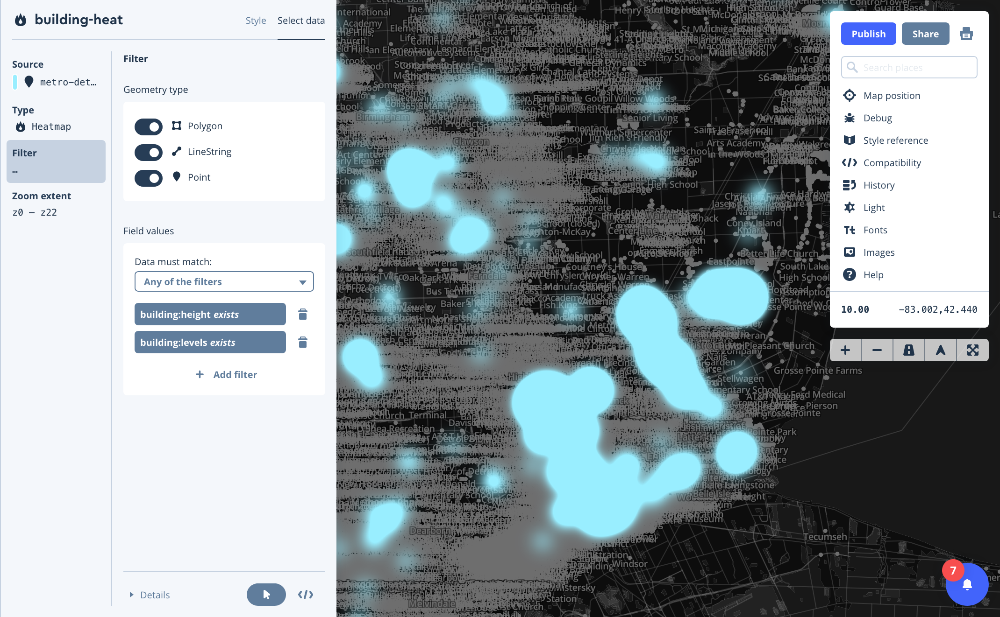

That’s quite a difference:

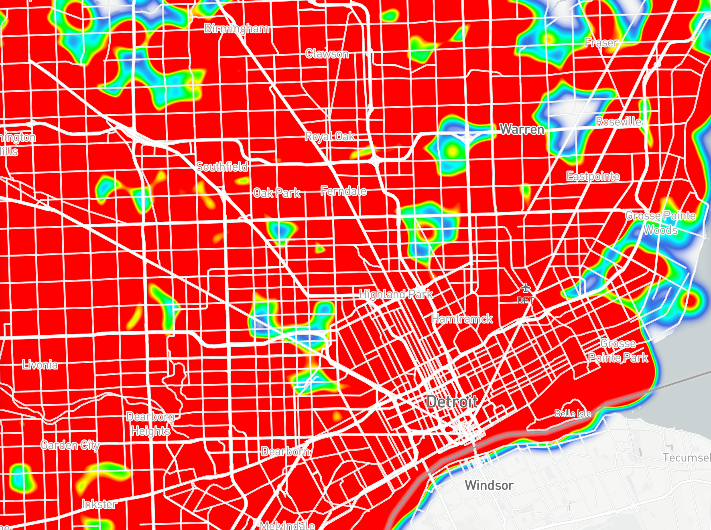
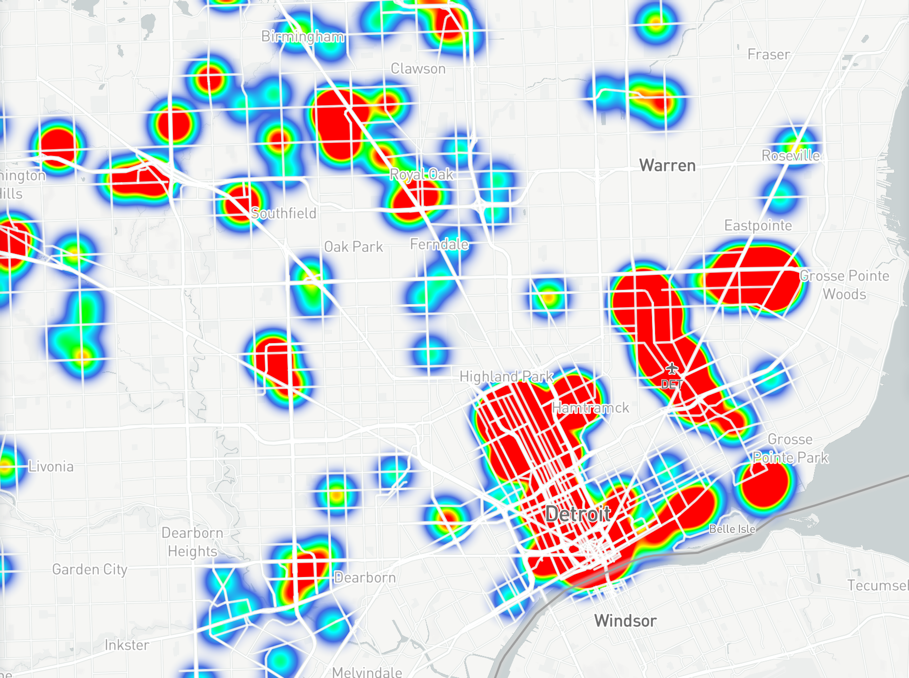

Windsor looks pretty lonely compared to Detroit. But it isn’t the Canadians’ fault; it’s just that my query excluded the Canadian side. To make this context clear, we can deemphasize land that isn’t part of the focus area.

Click the Raw button in [this gist](https://gist.github.com/1ec5/0167a2c37eac829a2fa8a58eb5a031bf) and download the GeoJSON file. (Instructions for generating this GeoJSON file from an overpass turbo query are included in the gist.) Upload the GeoJSON file as a tileset. Add a fill layer using this tileset. Move the fill layer toward the bottom of the layer stack, just above the background layer (which represents land in general). Set its fill color to the same value as the background layer’s color, then change the background layer’s color to something more drab.

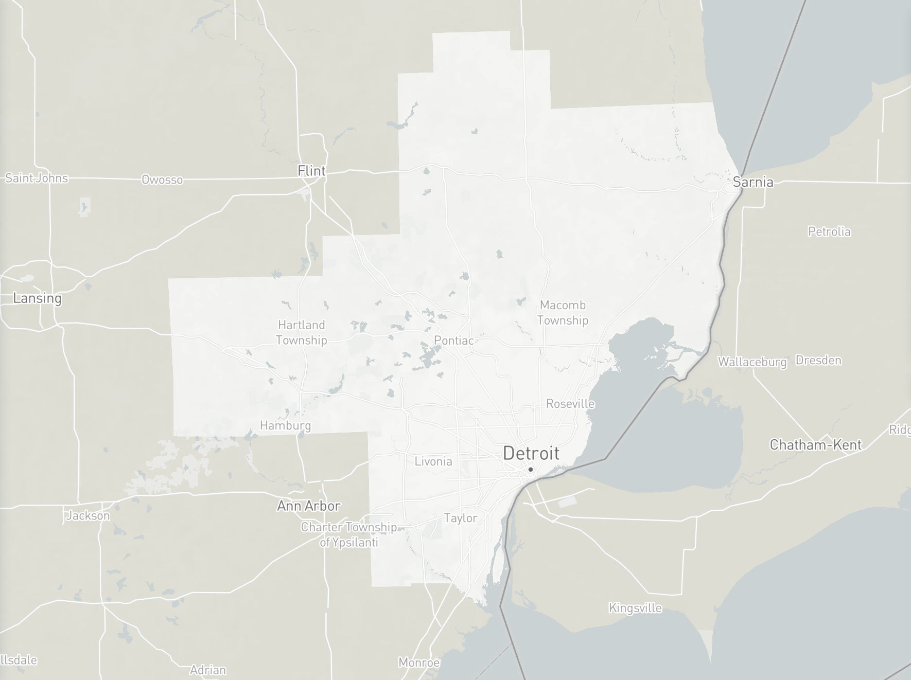
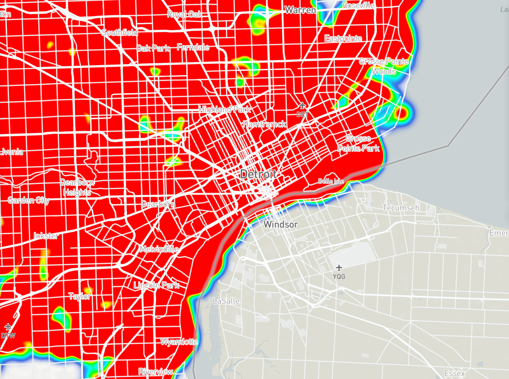


[View the final result](https://api.mapbox.com/styles/v1/1ec5/cjmvga1fq0rh92rpdfjj69u5f.html?fresh=true&title=true&access_token=pk.eyJ1IjoiMWVjNSIsImEiOiJjamdjMXhlbHQzMWRkMnBxZDczc2JrYmtyIn0.H0YBESgXdew_WMMk1e_9cg#10.0/42.334653/-83.005655/0)
